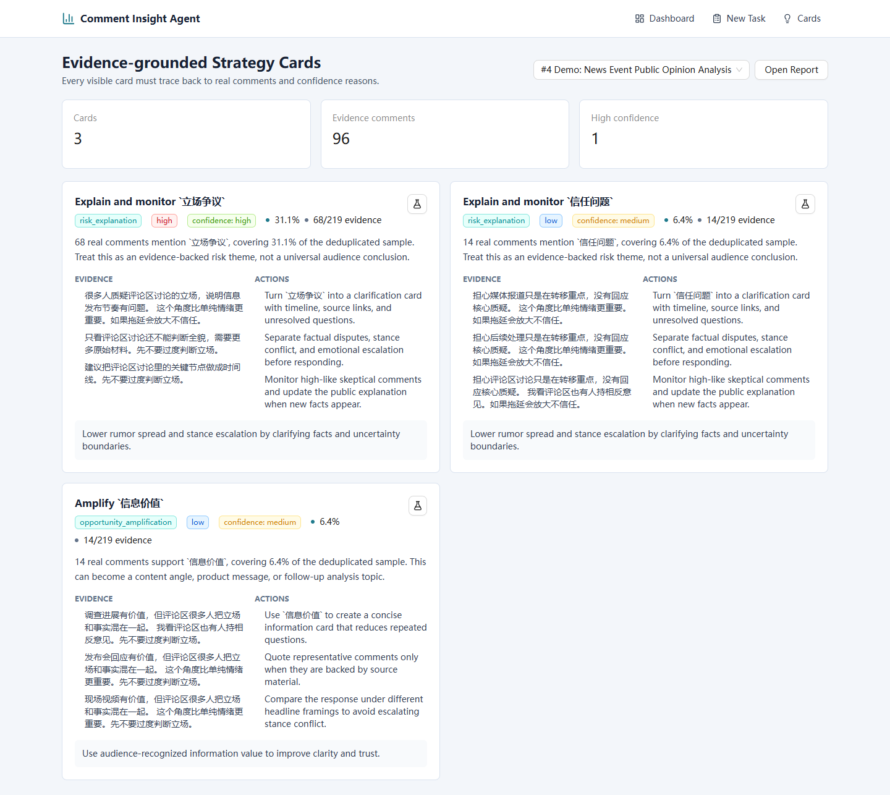
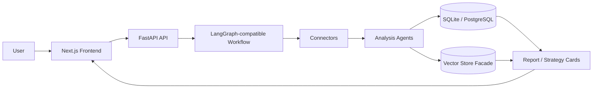
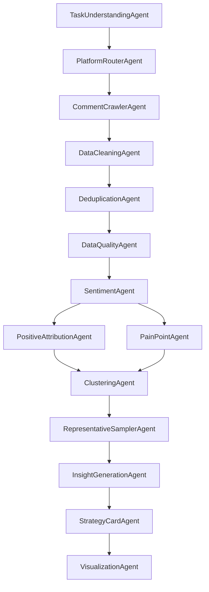

# Cross-Platform Comment Insight Agent

Turn public comments into evidence-grounded insights, topic clusters, strategy cards, and A/B testing ideas with a Multi-Agent workflow.

Repository: https://github.com/onlykillerf/comment-insight-agent

中文定位：一个将多平台公开评论自动转化为情绪洞察、主题聚类、痛点归因、策略卡片和 A/B 实验建议的 Multi-Agent 开源框架。

## Screenshots

> Screenshots are stored in `docs/assets/`. Regenerate them after UI changes with Playwright or your browser.

| Dashboard | Task Status |
| --- | --- |
|  |  |

| Analysis Report | Strategy Cards |
| --- | --- |
|  |  |

## Why This Project

Most comment-analysis tools stop too early:

- They classify sentiment but do not tell you what to do next.
- They generate word clouds but do not explain evidence or confidence.
- They collect comments but do not form an analysis loop.
- They ignore sample quality, duplicates, and noisy comments.
- They use generic labels that do not fit game, sports, esports, news, or draft-analysis contexts.

This project builds a full loop:

```text
comment import/collection
→ cleaning and deduplication
→ data quality guardrails
→ sentiment and stance analysis
→ domain taxonomy attribution
→ topic clustering
→ representative comments
→ LLM insight summary
→ evidence-grounded strategy cards
→ A/B testing ideas
```

## Core Features

- **Multi-Agent workflow**: task understanding, routing, crawling/import, cleaning, deduplication, quality, sentiment, attribution, clustering, sampling, insight, strategy, visualization.
- **Cross-platform connector interface**: Mock, CSV, JSON, MediaCrawler export/adapter, plus stubs for future public-data connectors.
- **Data quality guardrails**: raw count, clean count, dedup count, duplicate ratio, noise ratio, language distribution, and sample confidence.
- **Domain taxonomy**: game, IAA game, esports, sports, news, and NBA draft labels.
- **Sentiment and stance analysis**: rule-based local baseline that can be replaced by stronger models.
- **Topic clustering**: HDBSCAN when available, KMeans fallback, and explicit noise clusters.
- **Representative comment sampling**: high-signal comments selected per cluster.
- **Evidence-grounded strategy cards**: every card includes evidence comments, affected ratio, confidence, confidence reason, and A/B test design.
- **MockLLM fallback**: the project runs without real API keys.
- **Markdown report export**: export a portable report from each task.
- **Compliance-first crawling design**: no bypassing login, CAPTCHA, paywalls, or platform permissions.

## Architecture



## Multi-Agent Workflow



## Quick Start

Prerequisites:

- Python 3.11+
- Node.js 20 LTS, recommended `>=20.19.0`
- npm 10+
- Git
- Docker Desktop, optional and only required for Full Stack Mode

### Fast Local Demo, No Docker Required

This is the recommended v0.1 path. It uses SQLite and `MockLLM`, so you can run the full demo without Docker or real API keys.

Windows PowerShell:

```powershell
git clone https://github.com/onlykillerf/comment-insight-agent.git
cd comment-insight-agent
Copy-Item .env.example .env

python -m venv .venv
.\.venv\Scripts\Activate.ps1
python -m pip install -U pip

cd backend
python -m pip install -e ".[dev]"
uvicorn app.main:app --reload
```

If PowerShell blocks venv activation, run `Set-ExecutionPolicy -Scope Process Bypass` in the same terminal and activate again.

macOS / Linux:

```bash
git clone https://github.com/onlykillerf/comment-insight-agent.git
cd comment-insight-agent
cp .env.example .env

python3 -m venv .venv
source .venv/bin/activate
python -m pip install -U pip

cd backend
python -m pip install -e ".[dev]"
uvicorn app.main:app --reload
```

Start the frontend in a second terminal:

Windows PowerShell:

```powershell
cd comment-insight-agent\frontend
npm install
npm run dev
```

macOS / Linux:

```bash
cd comment-insight-agent/frontend
npm install
npm run dev
```

### Optional Full Stack Mode

Docker Compose starts Postgres, Redis, and Qdrant for a fuller local stack. Docker Desktop must be installed and running before this command.

Windows PowerShell / macOS / Linux:

```bash
docker compose up -d
```

Open:

- Frontend: `http://localhost:3000`
- API: `http://localhost:8000`
- API health: `http://localhost:8000/api/health`

## Run Demo Scenarios

Generate demo datasets:

```bash
python backend/scripts/seed_demo_data.py
```

Run complete demo tasks:

```bash
python backend/scripts/run_demo_task.py --scenario nba_draft
python backend/scripts/run_demo_task.py --scenario iaa_game
python backend/scripts/run_demo_task.py --scenario news_event
```

By default, `run_demo_task.py` forces `LLM_PROVIDER=mock` so demos do not consume real API credits. Add `--real-llm` if you want to use your configured provider.

## Demo Scenarios

### NBA Draft Opinion Analysis

Input: `data/demo/nba_draft_comments.csv`

Output:

- Prospect sentiment and stance
- Draft-order controversy clusters
- Player template and team-fit opportunity labels
- Evidence-grounded strategy cards for draft explainers

Example strategy direction: explain why `顺位过高争议` is a risk theme using representative comments, scouting context, and team-fit analysis.

### IAA Game Review Pain Point Mining

Input: `data/demo/iaa_game_comments.csv`

Output:

- Ad fatigue and forced-ad risk
- Onboarding friction and retention blockers
- Positive hooks around lightweight gameplay and reward feedback
- A/B testing ideas for ad frequency, onboarding copy, and reward triggers

Example strategy direction: reduce `强制广告打断` by mapping evidence comments to journey steps and testing ad-frequency controls.

### News Event Public Opinion Analysis

Input: `data/demo/news_event_comments.csv`

Output:

- Trust and transparency risks
- Stance divergence and emotional escalation
- Representative comments for clarification needs
- Strategy cards for source-backed timeline and clarification content

Example strategy direction: turn `信息不透明` into a clarification card with timeline, sources, and unresolved questions.

## Strategy Card JSON

```json
{
  "title": "Explain and monitor `强制广告打断`",
  "type": "problem_fix / opportunity_amplification / risk_explanation / ab_test",
  "evidence_comments": [
    "失败结算强制广告太多，刚进入关键环节就被打断。",
    "奖励广告可以有，但不要每一关都强制看。"
  ],
  "evidence_count": 42,
  "sample_size": 320,
  "affected_ratio": "13.1%",
  "confidence": "medium",
  "confidence_reason": "Evidence comes from real classified comments, but the sample or sentiment concentration is not yet strong enough for high confidence.",
  "suggested_actions": [
    "Map evidence comments to onboarding, failure screen, ad trigger, reward claim, or match result.",
    "Run an A/B test for ad frequency and reward-trigger timing."
  ],
  "expected_impact": "Reduce review risk and retention loss by tying pain points to concrete product experiments.",
  "ab_test_design": {
    "control_group": "Current ad trigger flow.",
    "experiment_group": "Reduced forced-ad frequency with clearer reward copy.",
    "metrics": ["D1_retention", "session_length", "ad_completion_rate", "negative_review_rate"]
  }
}
```

## Extending The Project

### Add a Platform Connector

Implement `PlatformConnector` in `backend/app/connectors/base.py`:

```python
class MyConnector:
    name = "my_platform"

    def fetch_comments(self, request: FetchRequest) -> list[NormalizedComment]:
        return [...]
```

Register it in `PlatformRouterAgent`.

### Add a Domain Taxonomy

Add a `DomainTaxonomy` entry in `backend/app/taxonomies/domain_taxonomy.py` with:

- `positive_labels`
- `negative_labels`
- `stance_labels`
- keyword hints for positive, negative, and stance classification

### Add an LLM Provider

Extend `LLMService._provider_config()` and `_has_provider_key()` in `backend/app/services/llm_service.py`. The service expects an OpenAI-compatible chat completions response.

### Add an Agent

Add an agent under `backend/app/agents/`, then wire it into `CommentAnalysisGraph` after the stage that provides its required input.

### Connect MediaCrawler

This repository does not copy MediaCrawler source code. Configure a local checkout:

```bash
MEDIA_CRAWLER_PATH=/path/to/MediaCrawler
```

Use `MediaCrawlerAdapter` or import existing MediaCrawler CSV/JSON/JSONL/SQLite exports with `MediaCrawlerExportConnector`.

## Compliance

- Only process public, user-provided, or synthetic sample data.
- Do not bypass login, CAPTCHA, paywalls, anti-bot controls, or platform permissions.
- Do not collect private user data.
- The default demos use mock/sample data.
- Real platform connectors must be configured and operated by users in compliance with platform terms and local laws.

## Roadmap

- **v0.1 MVP**: mock/sample data, workflow, report page, strategy cards.
- **v0.2 MediaCrawler Adapter**: local MediaCrawler export normalization and adapter docs.
- **v0.3 More Domain Taxonomies**: richer game, sports, esports, finance, product-review taxonomies.
- **v0.4 Online Dashboard**: async tasks, historical comparison, saved reports, team workspace.
- **v0.5 Evaluation Benchmark**: labeled demo sets, sentiment checks, cluster coherence, strategy-card hallucination checks.

## Documentation

- [Project audit](docs/project_audit.md)
- [Architecture](docs/architecture.md)
- [Agent design](docs/agent_design.md)
- [Connectors](docs/connectors.md)
- [Domain taxonomy](docs/domain_taxonomy.md)
- [Strategy cards](docs/strategy_cards.md)
- [Demo guide](docs/demo_guide.md)
- [Evaluation](docs/evaluation.md)

## License

MIT
