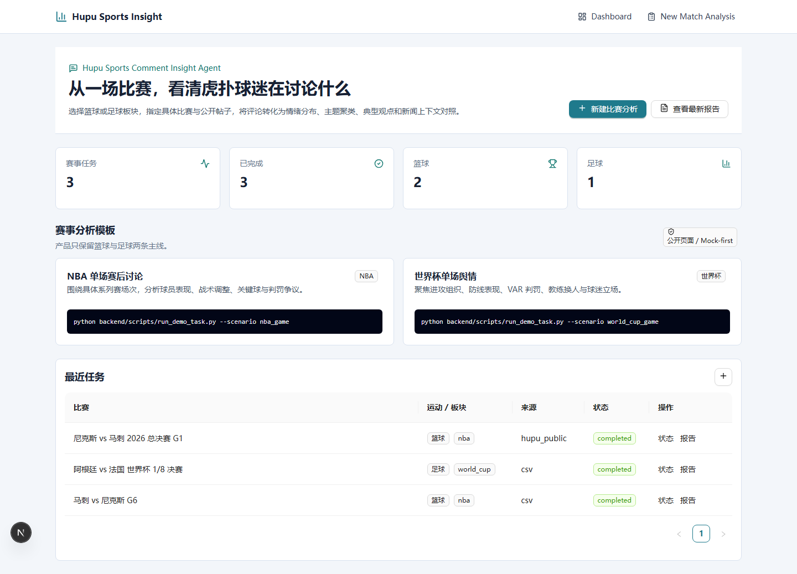
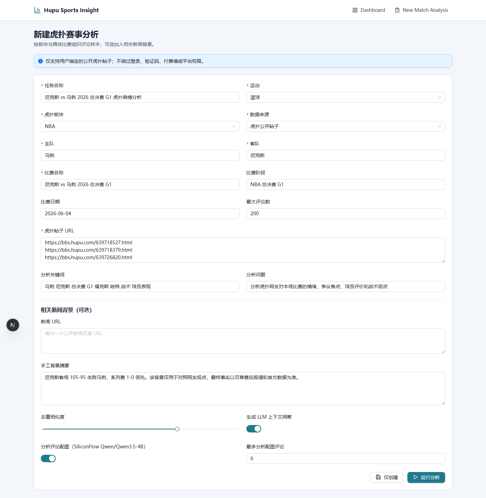
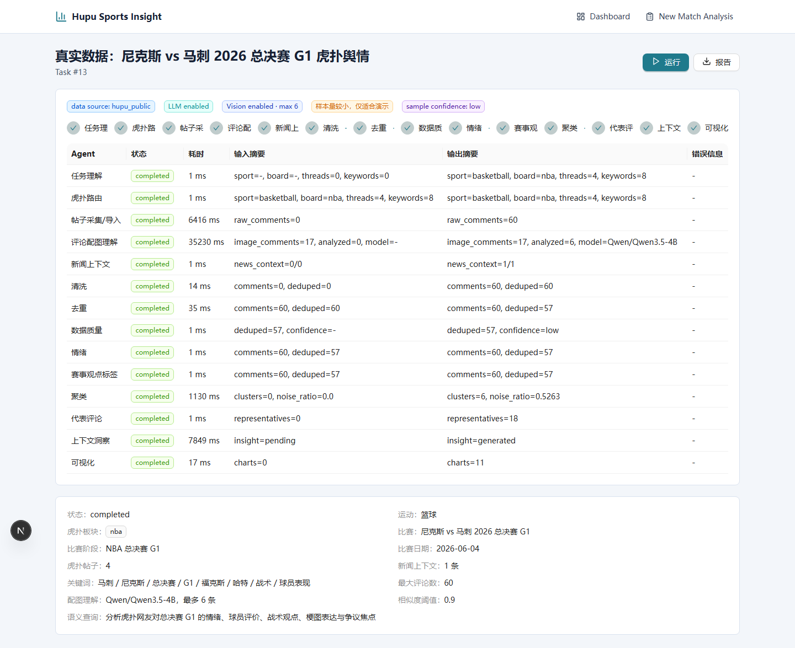
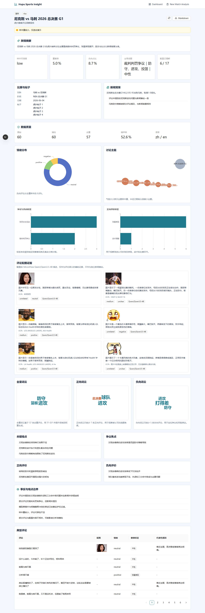
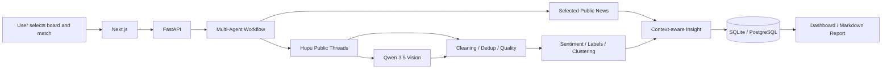
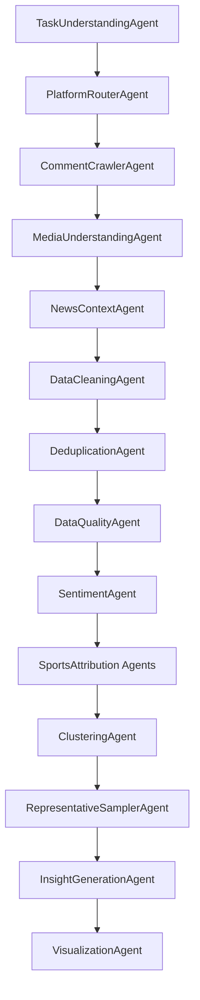

# Hupu Sports Comment Insight Agent

Turn public Hupu match discussions and comment images into sentiment trends, topic clusters, representative opinions, and news-context comparisons.

一个聚焦虎扑篮球与足球板块的赛事评论分析 Multi-Agent 项目：选择板块和具体比赛，导入公开帖子评论，并结合相关新闻背景分析球迷情绪、争议焦点与主要观点。

Repository: https://github.com/onlykillerf/comment-insight-agent



| Match setup | Agent status |
| --- | --- |
|  |  |



## Why This Focus

通用“跨平台、多领域”设计很容易变成配置很多、结论很浅。本项目现在只解决一个清晰问题：

> 对一场具体篮球或足球比赛，虎扑网友在讨论什么，情绪如何，争议来自哪里，评论与新闻事实背景是否一致？

分析链路：

```text
选择篮球/足球
→ 选择虎扑板块（NBA、世界杯等）
→ 指定具体比赛
→ 读取用户指定的公开虎扑帖子
→ 用 Qwen/Qwen3.5-4B 理解少量唯一评论配图
→ 清洗、去重和样本质量检查
→ 情绪与赛事标签分析
→ 主题聚类与典型评论
→ 读取可选的公开新闻背景
→ 对照新闻事实与网友观点
→ 生成 Markdown 舆情报告
```

## Core Features

- **Focused sports scope**: only basketball and football taxonomies are exposed.
- **Match-first task model**: sport, Hupu board, teams, stage, date, and selected thread URLs.
- **Hupu public-thread connector**: reads public `bbs.hupu.com` pages and paginated replies selected by the user.
- **Thread context**: analyzes the original post title and body excerpt, not comments in isolation.
- **Comment-image understanding**: extracts public reply images and analyzes a bounded, URL-deduplicated subset with SiliconFlow `Qwen/Qwen3.5-4B`.
- **News context**: accepts a manual match brief or selected public news URLs.
- **Fact/opinion boundary**: news is treated as context; sampled comments are never presented as verified facts.
- **Outcome guardrail**: filters LLM claims that contradict an explicit winner/loser relationship in the provided context.
- **Data quality guardrails**: raw, clean, deduplicated and noise counts with sample-confidence warnings.
- **Sports sentiment and labels**: basketball and football-specific positive, negative, and stance labels.
- **Topic clustering**: HDBSCAN when available, with KMeans/rule fallback and an explicit noise cluster.
- **Representative comments**: comments remain traceable to their original public thread.
- **Mock-first**: the full workflow runs without a real platform request or LLM key.
- **MockLLM fallback**: real OpenAI-compatible providers remain optional.

This project does **not** generate strategy cards or A/B testing ideas.

## Architecture





## Fast Local Demo

The recommended path uses SQLite, synthetic Hupu-style comments, and MockLLM. Docker is not required.

### Windows PowerShell

```powershell
git clone https://github.com/onlykillerf/comment-insight-agent.git
cd comment-insight-agent
Copy-Item .env.example .env

python -m venv .venv
.\.venv\Scripts\Activate.ps1
python -m pip install -U pip
python -m pip install -e ".\backend[dev]"

python backend/scripts/seed_demo_data.py --scenario all
python backend/scripts/run_demo_task.py --scenario nba_game
```

Start the API in the first terminal:

```powershell
python -m uvicorn app.main:app --app-dir backend --reload
```

Start the frontend in a second terminal with Node.js 20.19+:

```powershell
cd frontend
npm install
npm run dev
```

Open http://localhost:3000.

### macOS / Linux

```bash
git clone https://github.com/onlykillerf/comment-insight-agent.git
cd comment-insight-agent
cp .env.example .env

python -m venv .venv
source .venv/bin/activate
python -m pip install -U pip
python -m pip install -e "./backend[dev]"

python backend/scripts/seed_demo_data.py --scenario all
python backend/scripts/run_demo_task.py --scenario world_cup_game
```

Then run the same backend and frontend commands shown above.

## Demo Scenarios

```bash
python backend/scripts/run_demo_task.py --scenario nba_game
python backend/scripts/run_demo_task.py --scenario world_cup_game
```

Each scenario contains 320 synthetic comments and produces:

- data quality metrics and confidence warning
- sentiment distribution
- basketball/football-specific labels
- topic clusters and noise ratio
- all/positive/negative TF-IDF word clouds
- representative comments
- MockLLM or real-LLM contextual insight
- Markdown report

## Analyze Real Public Hupu Threads

1. Open **New Match Analysis**.
2. Select basketball or football and the Hupu board.
3. Fill in the teams, match stage, and date.
4. Choose **Hupu public threads** as the data source.
5. Paste one or more public `https://bbs.hupu.com/<thread-id>.html` URLs.
6. Optionally add public news URLs or a manual match brief.
7. Keep image analysis enabled to process up to six unique comment images with `Qwen/Qwen3.5-4B`.
8. Run the workflow.

The connector reads only public thread pages selected by the user. It does not search the whole site, use login cookies, call private APIs, or bypass platform controls. Image analysis receives only the public image URLs embedded in those replies. If Hupu changes its page structure or rejects the request, use a local CSV/JSON export instead.

Configure SiliconFlow in `.env`:

```dotenv
LLM_PROVIDER=siliconflow
LLM_BASE_URL=https://api.siliconflow.cn/v1
LLM_MODEL=Qwen/Qwen3-8B
SILICONFLOW_VISION_MODEL=Qwen/Qwen3.5-4B
SILICONFLOW_API_KEY=your-key
```

Only `high` and `medium` relevance image summaries enter text analysis. Low-relevance images and reaction memes remain visible in the evidence panel without polluting clusters or word clouds.

## News Context

News context is intentionally bounded:

- up to six user-selected public URLs per task
- article title, description, publish time, and a bounded body excerpt
- private/local URLs rejected
- fetch errors recorded without failing comment analysis
- LLM prompt explicitly separates news context from sampled fan opinions

## API Task Example

```json
{
  "name": "尼克斯 vs 马刺 2026 总决赛 G1 虎扑舆情分析",
  "domain": "basketball",
  "platforms": ["hupu"],
  "board": "nba",
  "match_name": "尼克斯 vs 马刺 2026 总决赛 G1",
  "home_team": "马刺",
  "away_team": "尼克斯",
  "match_stage": "NBA 总决赛 G1",
  "match_date": "2026-06-04",
  "thread_urls": ["https://bbs.hupu.com/639718527.html"],
  "news_urls": [],
  "news_context": "可选的比赛事实背景",
  "keywords": ["判罚", "战术", "关键球"],
  "semantic_query": "分析情绪、争议焦点和主要观点",
  "max_comments": 200,
  "enable_llm": true,
  "enable_image_analysis": true,
  "max_image_comments": 6,
  "data_source": "hupu_public"
}
```

Main endpoints:

- `POST /api/tasks`
- `POST /api/tasks/{id}/run`
- `GET /api/tasks/{id}/quality`
- `GET /api/tasks/{id}/sentiment`
- `GET /api/tasks/{id}/clusters`
- `GET /api/tasks/{id}/comments`
- `GET /api/tasks/{id}/insights`
- `GET /api/tasks/{id}/report/markdown`

## Optional Full Stack Mode

Docker Desktop must be running first:

```bash
docker compose up -d
```

SQLite remains the default local database. Docker services are optional infrastructure for further development.

## Compliance

- Only process publicly accessible pages explicitly selected by the user.
- Do not bypass login, CAPTCHA, paywalls, anti-bot controls, or platform permissions.
- Do not collect private profiles or expose author identities; connectors store an author hash.
- Respect platform terms, robots policies, rate limits, copyright, and applicable local laws.
- Prefer synthetic demos or user-provided exports when public-page access is unstable.

## Development

```bash
python -m pytest backend/app/tests
cd frontend
npx tsc --noEmit
npm run build
```

See [architecture](docs/architecture.md), [agent design](docs/agent_design.md), [connectors](docs/connectors.md), [sports taxonomy](docs/domain_taxonomy.md), and [demo guide](docs/demo_guide.md).

## License

MIT
