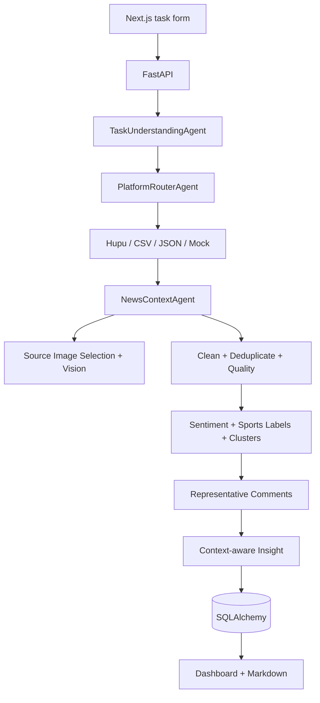

# Architecture

## Product Boundary

The application analyzes one basketball or football match at a time. A task is anchored by:

- sport: `basketball` or `football`
- Hupu board, such as `nba` or `world_cup`
- home team, away team, stage, and date
- user-selected public Hupu thread URLs or a local CSV/JSON export
- optional public news URLs or a manual match brief

## Data Flow

## Storage

- `tasks`: match identity, selected Hupu threads, optional news context, image-analysis limits, runtime settings, and agent progress.
- `raw_comments`: normalized public comment text with author hashes and source URLs; reply images are not collected.
- `clean_comments`: cleaned text, duplicate status, quality score, sentiment, and sports labels.
- `data_quality_reports`: sample counts, duplicate/noise ratios, language distribution, and confidence.
- `cluster_results`: topic size, keywords, sentiment distribution, noise flag, and representative comments.
- `representative_comments`: traceable high-signal examples.
- `insight_reports`: viewpoints, controversies, news context comparison, selected source-image evidence, fact/opinion gaps, and risks.

SQLite is the local default. Small additive schema upgrades keep existing demo databases usable.

## Trust Boundary

The crawler reads only URLs explicitly supplied by the user. News and thread fetch failures are visible; the workflow does not use authentication cookies or private APIs. Reply images are ignored. When enabled, a bounded set of informative main-post, news, or official images is sent to SiliconFlow. Visual evidence stays separate from comment NLP and must retain its source URL, authority level, and confidence.
