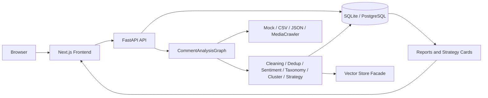

# Architecture

## System Overview

Cross-Platform Comment Insight Agent is a local-first web application:

- Frontend: Next.js, TypeScript, Ant Design, ECharts.
- Backend: FastAPI, SQLAlchemy, LangGraph-compatible workflow.
- Storage: SQLite by default; PostgreSQL, Redis, and Qdrant are available through `docker-compose.yml`.
- Analysis: rule-based baselines, deterministic embeddings, domain taxonomy, optional OpenAI-compatible LLM providers.

## Data Flow

1. User creates a `Task`.
2. `PlatformRouterAgent` maps `data_source` to connector plans.
3. Connectors normalize records into RawComment dictionaries.
4. Cleaning and deduplication produce CleanComment records.
5. DataQualityReport is computed from raw, clean, deduped, duplicate, noise, and language metrics.
6. Sentiment and taxonomy agents annotate comments.
7. Clustering groups comments and creates explicit noise clusters.
8. RepresentativeSamplerAgent selects high-signal examples.
9. InsightGenerationAgent summarizes structured results with MockLLM or a real provider.
10. StrategyCardAgent generates evidence-grounded cards.
11. VisualizationService builds frontend chart payloads.
12. Persistence stores all artifacts for API and Markdown export.

## Storage Design

Main tables in `backend/app/models/records.py`:

- `tasks`
- `raw_comments`
- `clean_comments`
- `comment_embeddings`
- `sentiment_results`
- `painpoint_results`
- `positive_attribution_results`
- `cluster_results`
- `representative_comments`
- `data_quality_reports`
- `insight_reports`
- `strategy_cards`

The project currently uses SQLAlchemy `create_all` and small additive SQLite upgrades. Production deployments should add Alembic migrations.

## Frontend / Backend Interaction

Frontend API wrapper: `frontend/src/api/client.ts`

Important routes:

- `POST /api/tasks`
- `POST /api/tasks/{id}/run`
- `GET /api/tasks/{id}/status`
- `GET /api/tasks/{id}/quality`
- `GET /api/tasks/{id}/comments`
- `GET /api/tasks/{id}/sentiment`
- `GET /api/tasks/{id}/clusters`
- `GET /api/tasks/{id}/wordclouds`
- `GET /api/tasks/{id}/strategy-cards`
- `GET /api/tasks/{id}/report/markdown`

## Deployment Notes

The MVP runs locally with SQLite. Docker Compose starts optional infrastructure:

- PostgreSQL
- Redis
- Qdrant

The workflow is synchronous today. For production, move task execution to a queue and stream progress updates to the frontend.
